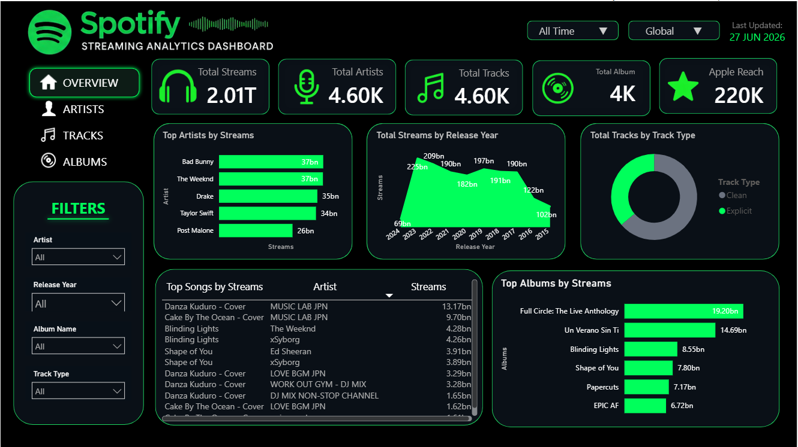
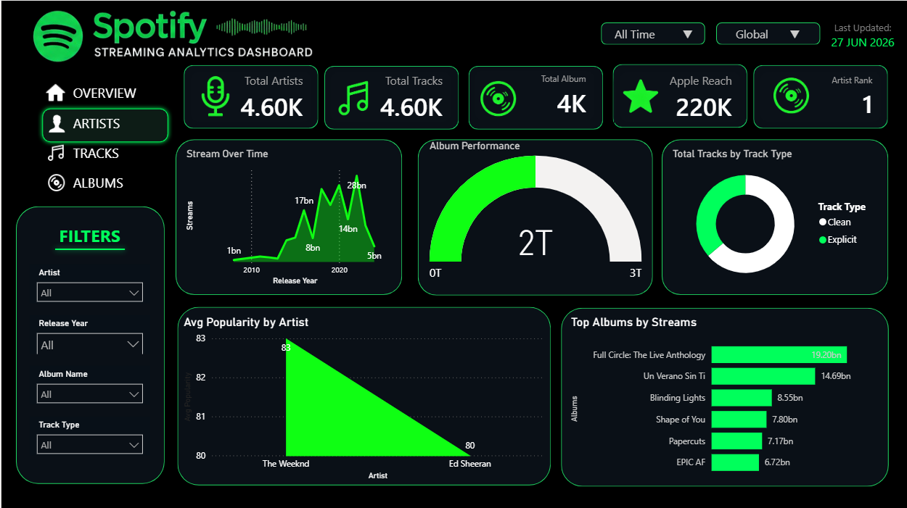
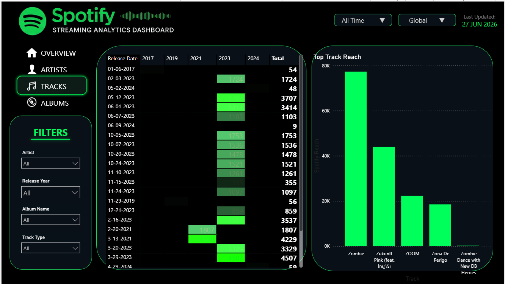
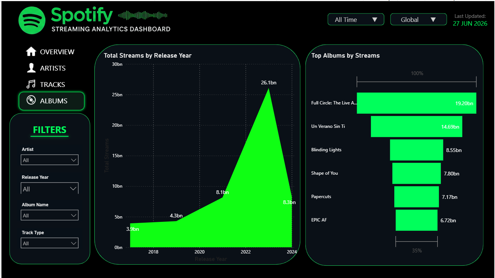

# 🎵 Spotify Streaming Analytics Dashboard

An interactive **Power BI dashboard** designed to analyze Spotify streaming data and provide insights into artist performance, album popularity, track engagement, and streaming trends. This project helps stakeholders make data-driven decisions through intuitive visualizations and interactive filters.

---

# 📸 Dashboard Preview

## 1. Overview Dashboard

Provides an executive summary of Spotify streaming performance with KPIs, top artists, top songs, album rankings, and streaming trends.

---

## 2. Artists Dashboard

Analyzes artist popularity, stream growth, album performance, and track distribution.

---

## 3. Tracks Dashboard

Displays track reach, release analysis, and top-performing songs.

---

## 4. Albums Dashboard

Shows album rankings, release-year trends, and album performance metrics.

---

# 📌 Project Overview

The Spotify Streaming Analytics Dashboard transforms raw Spotify streaming data into meaningful business insights using **Power BI**, **Power Query**, and **DAX**. The dashboard enables users to monitor streaming KPIs, analyze trends, compare artist performance, and identify high-performing tracks and albums.

---

# 🎯 Objectives

- Monitor overall streaming performance
- Analyze artist popularity
- Track album performance
- Identify top-streamed songs
- Compare explicit vs. clean tracks
- Analyze release-year trends
- Support data-driven decision-making

---

# 📊 Dashboard Features

### Executive KPIs

- 🎧 Total Streams
- 🎤 Total Artists
- 🎵 Total Tracks
- 💿 Total Albums
- ⭐ Apple Reach
- 🏆 Artist Rank

### Interactive Filters

- Artist
- Release Year
- Album Name
- Track Type
- Time Period
- Region

---

# 📈 Key Insights

- **2.01T** Total Streams across the platform.
- **4.6K Artists** and **4.6K Tracks** analyzed.
- **4K Albums** included in the dataset.
- **220K Apple Reach**, indicating strong audience engagement.
- **Bad Bunny, The Weeknd, Drake, Taylor Swift, and Post Malone** are the highest-streamed artists.
- Recent releases generate the highest streaming activity.
- Explicit tracks contribute a significant share of total streams.
- Top albums and songs consistently drive user engagement.

---

# 💡 Business Insights

This dashboard helps answer key business questions:

- Which artists generate the highest streams?
- Which albums deserve additional promotion?
- Which songs have the greatest audience reach?
- What release years perform best?
- How does track type influence streaming performance?
- Which content should be prioritized in playlists?

---

# 🚀 Business Recommendations

- Invest more in top-performing artists.
- Promote high-performing albums through marketing campaigns.
- Feature popular songs in editorial playlists.
- Schedule releases based on historical streaming trends.
- Use track-type analysis to target different listener segments.
- Expand marketing efforts in high-engagement regions.

---

# 🛠️ Tools & Technologies

- **Power BI**
- **Power Query**
- **DAX**
- **Data Modeling (Star Schema)**
- **Spotify Streaming Dataset**

---

# 📂 Dashboard Pages

| Dashboard | Description |
|------------|-------------|
| Overview | Executive summary of streaming KPIs and trends |
| Artists | Artist performance and popularity analysis |
| Tracks | Track-level analytics and audience reach |
| Albums | Album rankings and release-year analysis |

---

# 📈 Business Value

The dashboard enables organizations to:

- Improve marketing ROI
- Identify trending artists and songs
- Optimize playlist recommendations
- Monitor streaming performance
- Support strategic business decisions
- Enhance audience engagement

---

# 🔮 Future Enhancements

- Spotify API integration
- Real-time dashboard refresh
- Revenue and royalty analytics
- Geographic streaming analysis
- AI-powered trend forecasting
- Listener segmentation
- Predictive analytics

---

# 👨‍💻 Author

**Your Name**

Power BI | Data Analytics | Business Intelligence

LinkedIn: https://linkedin.com/in/your-profile

GitHub: https://github.com/your-username

---

## ⭐ If you found this project useful, consider giving it a star!
